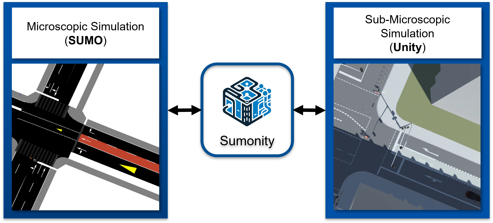
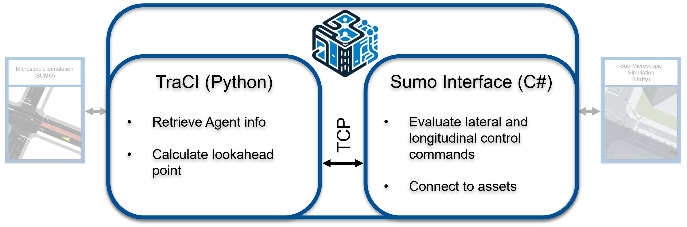
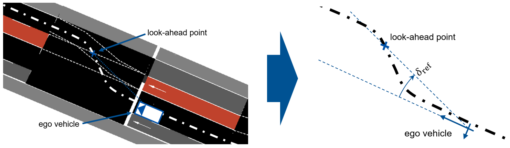

# README for Sumonity: Enhanced Traffic Simulation Interface

## Table of Contents
1. [Project Title](#project-title)
2. [Introduction](#introduction)
3. [Features](#features)
4. [Installation](#installation)
5. [Usage](#usage)
6. [Architecture](#architecture)
7. [Agent Information](#agent-information)
8. [Vehicle Control Mechanism](#vehicle-control-mechanism)
9. [Dependencies](#dependencies)
13. [Troubleshooting](#troubleshooting)
14. [Contributors](#contributors)
15. [License](#license)

---

## Project Title
### Sumonity: Enhanced Traffic Simulation Interface

## Introduction
Sumonity is a cutting-edge interface that integrates the Simulation of Urban MObility (SUMO) with the Unity game engine. This combination brings a new level of realism and interactivity to traffic simulations. By harnessing SUMO's comprehensive traffic modeling and Unity's advanced graphical engine, Sumonity offers unprecedented simulation fidelity and an enhanced user experience.



## Features
- **Microscopic Traffic Simulation**: Utilizes SUMO's detailed traffic modeling for highly realistic simulations.
- **Advanced Graphical Rendering**: Takes advantage of Unity's engine for superior visual quality.
- **Pure Pursuit Control**: Offers improved control over individual vehicle behaviors in Unity's simulation environment.
- **Flexible Vehicle Types**: Accommodates a variety of vehicle types including passenger cars, buses, taxis, and pedestrians.

## Installation

### Installation as project:

The best way to get started with Sumonity is by installing it as a complete Unity Project. Therefore, go to: https://github.com/TUM-VT/Sumonity-UnityBaseProject and follow the instructions. It will get all depedencies in a modular structure.

### Installation Standlone:
1. Get the sub repositories:
```
git submodule update --init --recursive
```

This submodule should point to your specific sumo project that you want to run in parallel to your unity simulation. In our framework we are using mathworks roadrunner to export the unity 3d environment alongside an opendrive map. We then convert the opendrive map to a sumo network file, which we are using in this system. The provided sumo repository shows the basic setup of the files.

2. Go into the sub repository for Sumo and install the virtual environment as follows:

```
sudo apt install python3-pip python3-virtualenv python3-tk
pip3 install virtualenv
```
Now setup the virtual environment
```
virtualenv venv
source venv/bin/activate
pip install -r requirements.txt
```

3. Add the Sumo Bridge Prefab to your Unity Scene.


## Usage
Guidelines for using Sumonity are as follows:
- In order to achieve a synchronized sumo and untiy environment we are using mathwork roarunner to create the "digital twin" from there we export the 3d model to unity and the opendrive file to sumo. We convert the open drive file using netconvert:

```
netconvert --opendrive .\TUM_009.xodr -o tum_009.net.xml
```
Hint: Execute the comment using the active virtual environment.

After setting up the network file, we create demand etc. as usual.

## Architecture
Sumonity's architecture is built around a Python-based interface that connects SUMO and Unity. The following diagram provides an overview of this setup:



## Agent Information
Sumonity supports multiple SUMO vehicle types, each characterized by properties such as position, orientation, speed, and control signals.

## Vehicle Control Mechanism
- **Longitudinal Control**: Features a Proportional-Integral-Derivative (PID) controller for precise management of velocity and position.
- **Lateral Control**: Employs a Pure Pursuit Control (PPC) strategy for accurate path tracking.



## Dependencies
Setup is tested on Ubuntu 20.04.

## Troubleshooting
- setup the correct file in the socketServer.py
```
traci.start(["sumo","-c", "tum_008.sumocfg","--num-clients", "1"])
```
We are going to introduce a scenario selection menu in Unity in the future, to avoid this issue.


- make the script executable
```
sudo chmod +x socketServer.py
```

- module not found error:
Make sure you have installed the virtual environment, by following the installation instructions.


## License
MIT License

Copyright (c) 2024 TUM Chair of Traffic Engineering and Control

Permission is hereby granted, free of charge, to any person obtaining a copy
of this software and associated documentation files (the "Software"), to deal
in the Software without restriction, including without limitation the rights
to use, copy, modify, merge, publish, distribute, sublicense, and/or sell
copies of the Software, and to permit persons to whom the Software is
furnished to do so, subject to the following conditions:

The above copyright notice and this permission notice shall be included in all
copies or substantial portions of the Software.

THE SOFTWARE IS PROVIDED "AS IS", WITHOUT WARRANTY OF ANY KIND, EXPRESS OR
IMPLIED, INCLUDING BUT NOT LIMITED TO THE WARRANTIES OF MERCHANTABILITY,
FITNESS FOR A PARTICULAR PURPOSE AND NONINFRINGEMENT. IN NO EVENT SHALL THE
AUTHORS OR COPYRIGHT HOLDERS BE LIABLE FOR ANY CLAIM, DAMAGES OR OTHER
LIABILITY, WHETHER IN AN ACTION OF CONTRACT, TORT OR OTHERWISE, ARISING FROM,
OUT OF OR IN CONNECTION WITH THE SOFTWARE OR THE USE OR OTHER DEALINGS IN THE
SOFTWARE.

---

**Note:** This README is a work in progress. For sections marked as TODO, further details are required to complete this document. Please provide the missing information or check back later for updates.
